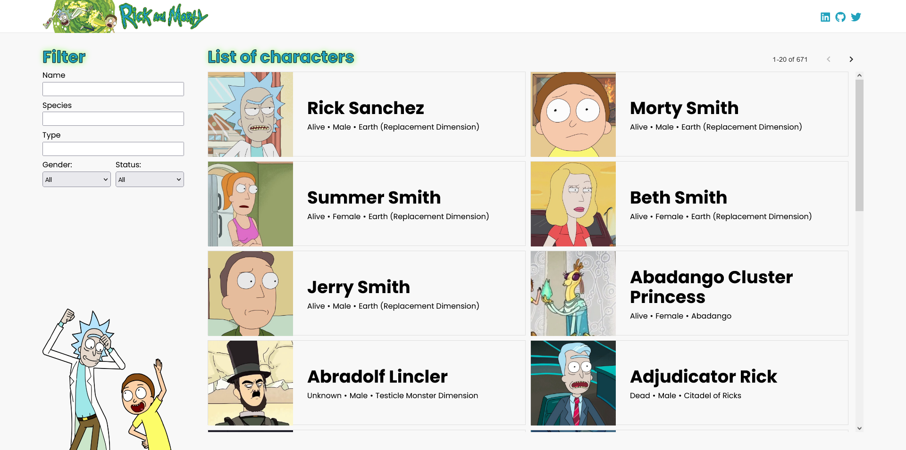
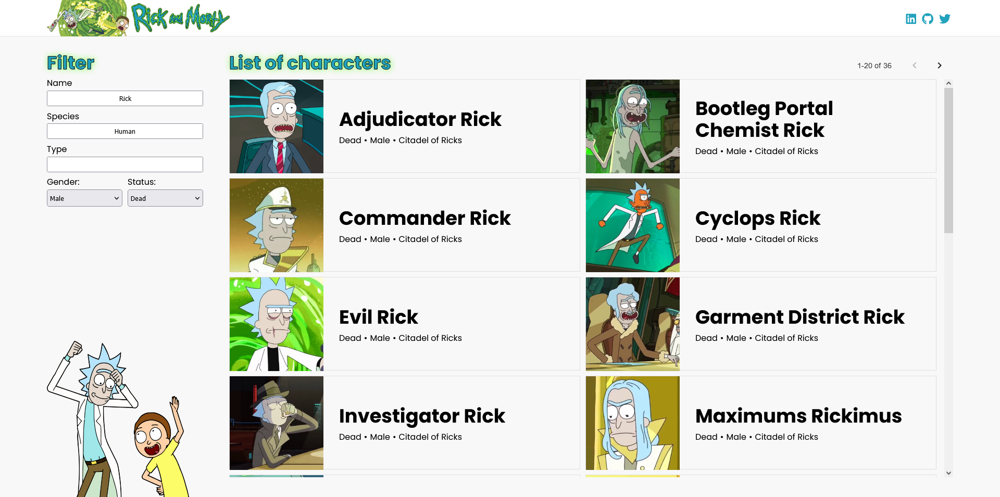
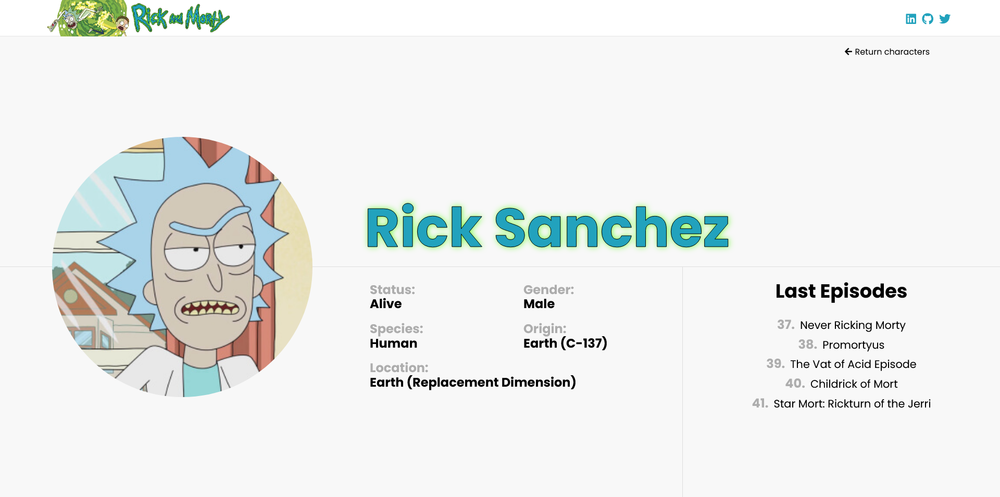
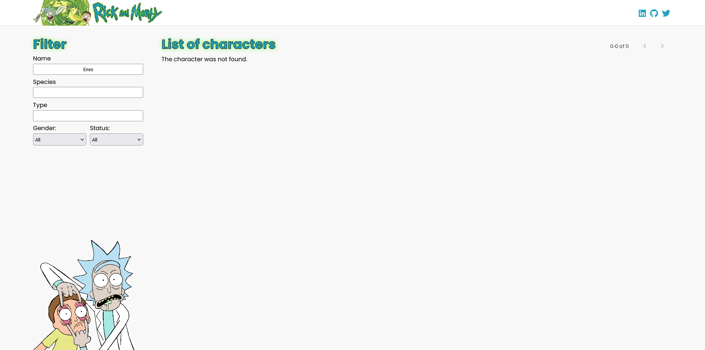
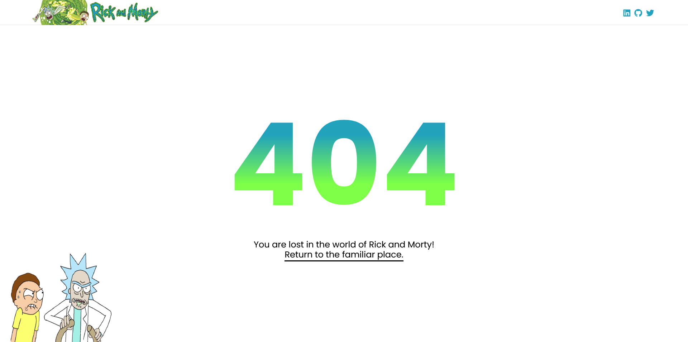

# Rick and Morty Characters Wiki

The purpose of this project is to list, filter and show details of Rick and Morty characters by pulling them from API. It is a **React** project and built with **create-react-app**. While coding, **ESLint** and **Prettier** were used together with the **AirBnb style guide**.

## Installation

You can download the project by cloning it from the Github site or by typing the following command:

```console
git clone https://github.com/baspinarenes/rick-and-morty-characters
```

## Run Project

In the project directory you can run the following lines:

```console
npm install
npm start
```

## Screenshots






